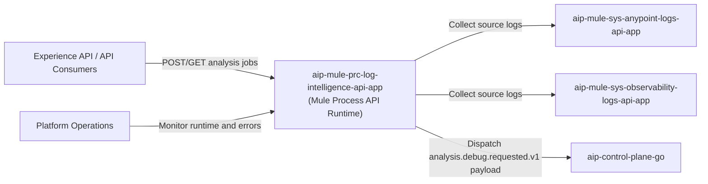
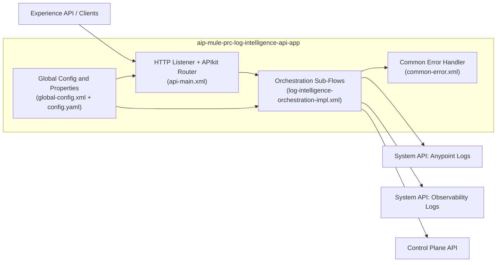
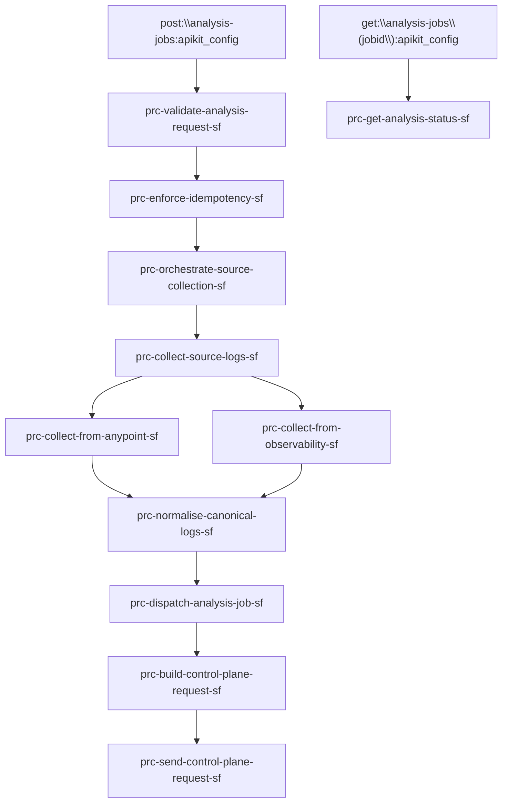
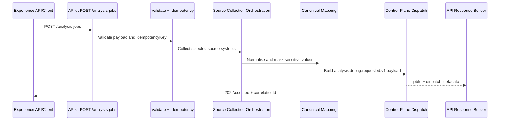

# C4 Model Diagrams - AIP Process Log Intelligence API Application

## Purpose

Provide implementation-centred architecture diagrams for this Mule Process API runtime so engineers can understand orchestration boundaries, runtime dependencies, and operational behaviour.

## C4 Level 1 - System Context

## C4 Level 2 - Container View

## C4 Level 3 - Component View (Orchestration Flows)

## Main Runtime Sequence - Analysis Job Submission

## Update Triggers

Update these diagrams whenever APIkit routes, orchestration sub-flow names, dependency endpoints, retry strategy, or error handling behaviour changes.
